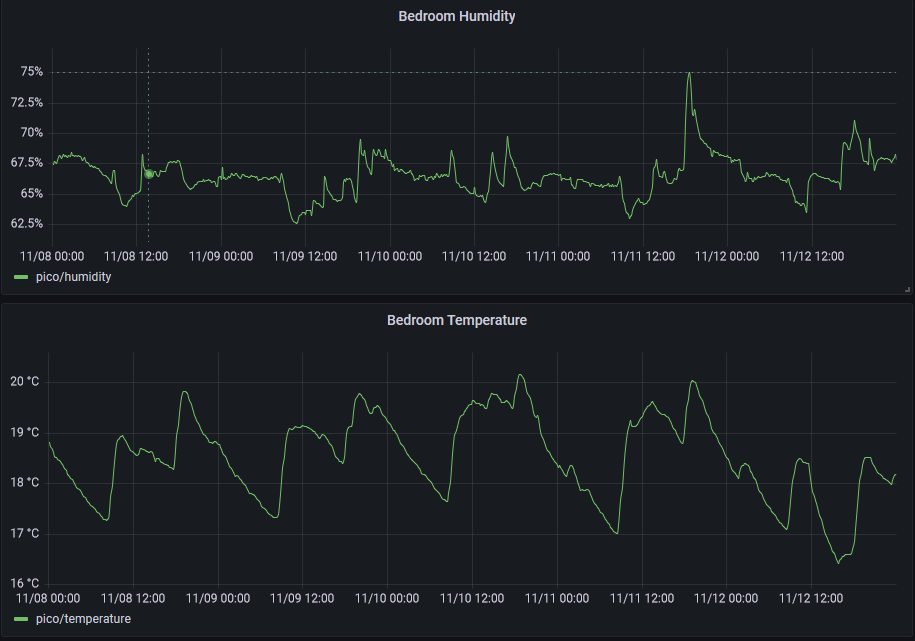

# pico-home-monitor

Micropython implementation of a simple home monitoring station using the Raspberry Pi Pico microcontroller. It periodically collects temperature, humidity, and pressure data from the BME280 sensor and publishes it to an MQTT broker for further consumption.

The MQTT broker sits on a Raspberry pi 4 which ingests the temperature and humidity into [influxdb](https://www.influxdata.com/) via telegraf. This is then visualised in a dashboard via [Grafana](https://grafana.com/). The entire stack is containerised and managed via docker compose. Ultimately this is exposed on my local network via [caddy](https://caddyserver.com/docs/), a reverse proxy.

## Overview:

- The `main.py` script initializes the BME280 sensor and Wi-Fi connection via the [`pico_wifi`](https://github.com/Sam-Sims/pico_wifi) module.
- Variables like ssid and password are defined in `config.py`
- It then connects to the specified MQTT broker.
- The publish function sends data to the broker with specified topics.
- The main loop continuously checks the Wi-Fi connection, reconnecting if necessary.
- It reads temperature, pressure, and humidity data from the BME280 sensor and publishes it to the MQTT broker every 5 minutes.

# Pico setup

The BME280 has 4 inputs:
- 2.5v power
- Data (SDA)
- Clock (SCL)
- Ground

### Pico pinouts

### Connections to BME680
- Power - pin36
- Ground - pin38
- SDA - pin1
- SCL - pin2
